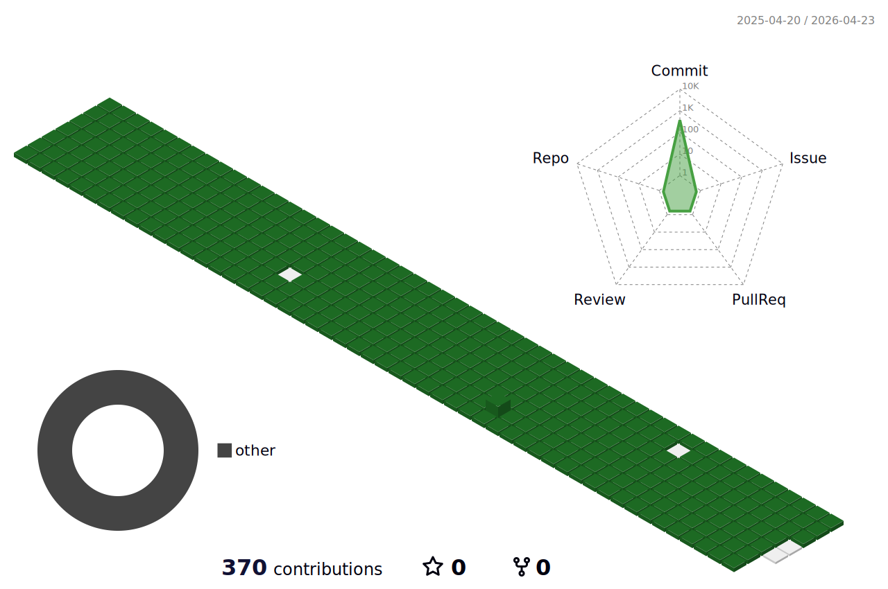

 💪 "Slow but steady wins the race" 👍 

---

 👋 SNS/Community 👋 

  
    
  
    
    
  

---

 ⭐ Skill ⭐ 

  
  
  
  
   
  
  
  
  
   
  
  
   
  
  
   
  

 🛠 Tool 🛠 

  
  
   
  
   
  
  
  
  
   

  

